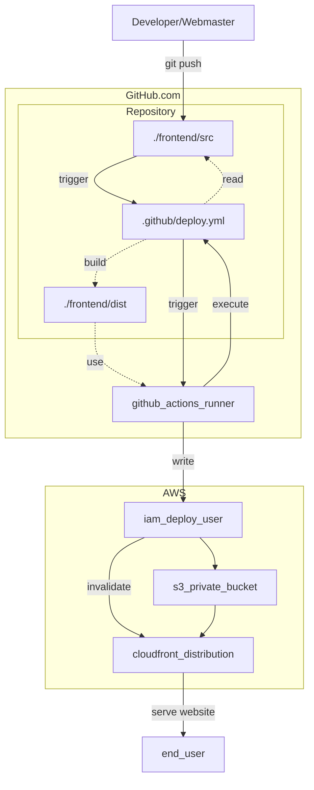
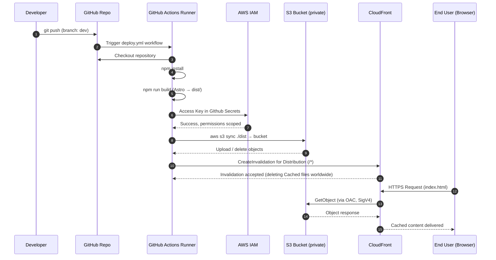

# aws-astro-headless-cms-deployment

This project is a basic proof of concept for a static Website living in GitHub and AWS.
Once set up, you just make changes to your website and a static generated version is deployed on CDNs worldwide as shown in [sequence diagram](#cd-continious-deployment-sequence).
Depending on size and frequency of updates, you can run this entirely free on Github and very little aws storage cost.
- astro static site generator (SSG)
- stored(src) on a github repository
- built(frontend dist) using github actions
- stored(frontend) on aws S3 and served by aws CloudFront CDN
- provisioned(S3 Bucket + CloudFront Distribution + DeployUser) using AWS CloudFormation

The human interaction is minimized to
- Set up once
  - clone or fork repository once
  - Create CloudFormation Stack once
  - Paste a CloudShell/cli command
  - transfer a few variables and secrets to Github repository settings
- Update your website
  - Change front end src
  - Push src to your repo

## How does it work?

The [cloudformation.yml](./cloudformation/cloudformation.cf.yml) is used to provision s3, CloudFront, and IAM deploy-user, and Policies/OAC/etc. 

When the Webmaster pushes source code changes to the "dev" branch, 


Astro static site generator builds your Website from markdown.
But instead of building and uploading the generated website by hand 

- you run `npm run build` within the `/frontend` directory
- Astro will build your static website and store it in the `/frontend/src` directory.

Instead of clicking throug your webspace provider, you run the CloudFormation temaplate to create a Stack to create Webspace.

- you upload the changes to your webspace
Here's where things get different
Instead looking for a webspace provider, uploading your website manually




## Quickstart

First you want to make sure you actually want an Astro website, otherwise you'd have to modify the deployment pipeline.
So have a look at [themes] and also the [astro] features. If you want more than a Static website, you'll have to implement stuff here and there.

You can clone this repo for a template of deploying a SSG website on AWS.
Or you can use it as walkthrough to build your own.

## AWS services used - tech stack 

- AWS CloudFormation Stacks
  - provisioning and optionally drift detection
- AWS S3 - Simple Storage Service
  - store website output, no public or website configuration
- AWS CloudFront
  - Server Website via Distribution(CSM) with OAC read access for s3 bucket to make website available worldwide
- AWS cli
  - used by CD pipeline
  - or deploy stack manually
- AWS CloudShell
  - create access keys
- IAM (create least-privilege aws user and access keys)

## prerequisites 

- aws account wit
- install NodeJS
- install aws cli
- install git
- some code editor (we use vscode, and plugins aws toolkit, git, astro)
- be able to run a console command on cmd, powershell, bash
  - beware: 
    - if you run wsl-bash (default), it might not find your windows git/npm/nodejs.
    - git for windows comes with a windows-native bash that can run your windows apps.


## CD (Continious Deployment) Sequence



## Enhancements & Next Steps

- custom sub/domain
- refine CD trigger (manually, PR)
- 2nd deployment for test+prod or release creation
- **fork away the github-actions-branch**
- implement dynamic serverless features into frontend
- move CD to AWS pipelines
  - no aws secrets on GH
  - CF to provision IAM access (no copypasta)
  - use aws roles w/sts (best practice)
  - monitoring and SNS notification
- eval: limit CloudFront invalidation to changed files or coordinate CD with TTL
- implement headless CMS (will add complexity and replace GH repo as single source of truth)
- evaluate weither TerraForm would include more tasks or generate complexity (state-management) without benefits

## directory structure

- frontend ontains the astro static site generator (ssg) project
- cloudformation for provisioning AWS infrastructure
- doc example files

## scafffold Astro (if not cloning this repo)

- clone or create new git repo
- choose a [theme][themes] (we go with "blog" and have a [patchfile][patchfile] for optionalle integrating strapi)
- cd into repo dir
- `npm create astro@latest -- --template blog frontend`
  - will generate an [astro] project
  - in case npm depency installation fails, close your loud sync, give your virus scanner 1-2 minutes (it probably checks npm_nodes) and run:
    - cd frontend
    - npm install

### build astro and run local webserver

You can now build html files from your astro project
- cd frontend

spin up an auto-refreshing **dev**eloper webserver, reflecting the current state of your src:
- `npm run dev` this will...
- spin up webserver on http://localhost:4321/
- ~~will open browser~~

finally, build your static website
- `npm run build`
- will store into "dist", which is ignored through [gitignore]
- in our setup, we will not store the ou tput files in the repo but sync them manually OR generate it remote using a pipeline.

start a static webserver for the "dist" directory, ignoring src changes:
- `npm run preview`

## provision

- deploy the CloudFormation stack using console.aws.amazon.com or aws cli `aws cloudformation deploy` or (create-stack / update-stack).
  - `aws cloudformation deploy --template-body 'file://cloudformation/cloudformation.cf.yml' --region=us-east-1 --stack-name WhatEverYouChose`
- You should be able to verify your stack status:
`aws cloudformation describe-stacks  --stack-name WhatEverYouChose  --query "Stacks[0].StackStatus"  --output text --region=us-east-1 --profile=myawsprofile`
  - must return **CREATE_COMPLETE**
- upload an index.html to the bucket or use the aws s3 command in the stack output to push your astro output manually
  - `aws s3 sync ./frontend/dist/ s3://${MyWebBucket} --delete --profile=myawsprofile`

## CloudFormation Outputs

After successfull deploy, the CloudFOrmation output will give you hands-on information
- CloudFrontDomainName
  - click this to access your website (after pushing an index.html)
- BucketNameWeb
  - The globally unique name of the Frotnend S3 bucket. It can only be read from your CloudFront Distribution OAC and is not public. You will need it later for the CI/CD pipeline.
- DistributionId
  - CloudFront CDN works through so-called Distributions, you need them you "distribute" your content over the world and profit from caching etc.
- DebugSyncCommand
  - this might help you pushing some content into the bucket
- BucketBlockedWebsite
  - Since the S3 Bucket is NOT configured as website, this should return *NoSuchWebsiteConfiguration*
- BucketBlockedUrl
  - The PUBLIC url to your Bucket, it should return *AccessDenied*

```yaml
  BucketNameWeb:
    Value: !Sub "${MyWebBucket}" 
  DistributionId:
    Value: !Sub "${CloudFrontDistribution}"
  CloudFrontDomainName:
    Value: !GetAtt CloudFrontDistribution.DomainName
  DebugSyncCommand:
    Value: !Sub "aws s3 sync ../frontend/dist/ s3://${MyWebBucket} --profile=myawsprofile" 
  BucketBlockedWebsite:
    Value: !Sub "http://${MyWebBucket}.s3-website-${AWS::Region}.amazonaws.com" 
  BucketBlockedUrl:
    Value: !Sub "https://${MyWebBucket}.s3.${AWS::Region}.amazonaws.com"
```

## copy website into bucket

aws s3 sync ./frontend/dist/ s3://cs-itp-ssg-cd-pub-dist-us-east-1-867405369211 --profile=myawsprofile


---

## strapi (out of scope of this project)

Whilst this project focuses on the SSG part, here are some steps to integrate strapi

### strapi quickstart without cloud

This is quick & dirty - you might not want to include [strapi] in the astro repository...

- change dir to project root
- npx dreate-strapi-app@latest backend-strapi
- cd backend-strapi
- npm run dev
  - alias for npm strapi develop
- a webbrowser should open, register and log in
  - mark draft posts and publish them to get some content

## integrate strapi into astro

Thats it. If you want Astro to query posts from [strapi], heres the local setup.
It does not follo the [Integration Guide][integrate] since we do not use its SaaS here.
- cd frontend-astro
- npm create astro@latest -- --template blog frontend-astro
  - IF NOT DONE YET
- `npx astro add tailwind`
- change/create files according to [patchfile]:
  - global.css:
    - add ``@import "tailwindcss";``
  - layouts/Layout.astro
    - (new file for strapi post layout)
  - src/types/strapi.ts
    - (new file contain data linking for promises)
  - src/pages/index.astro
    - (new startpage with strapi posts)
  - .env
    - `STRAPI_URL=http://localhost:1337`
    - for more flexibility

---

---

## authors
- [matt] Code
- [sam] Planning & Mentoring

## links and thanks

- [AWS guide+video on S3 w/ CloudFront and (outdated) OAI][guide_cloudfront]

[integrate]: https://strapi.io/integrations "strapi.io/integrations"
[themes]: https://astro.build/themes/1/?search=&price%5B%5D=free "Free Astro Starter Themes"
[astro]: https://astro.build/ "astro static site generator"
[strapi]: https://strapi.io/ "Strapi CMS - SaaS or selfhosted"

[patchfile]: ./doc/integrate_strapi_into_astro.patch "Patchfile"
[frontend]: ./frontend/ "frontend"
[gitignore]: ./frontend/.gitignore "frontend/.gitignore"
[dist]: ./frontend/dist/ "static website generated(built) by astro using `npm run build`"
[deploy]: ./.git

[repolink]: https://github.com/Codingschule/aws-astro-headless-cms-deployment "Internal link to this repository"
[matt]: https://github.com/yasuoiwakura "Matthias Block" 
[sam]: https://github.com/hackbraten68 "Sam Dillenburg"

[aws_oac]: https://aws.amazon.com/de/blogs/networking-and-content-delivery/amazon-cloudfront-introduces-origin-access-control-oac/ "AWS OAC INtroduction"
[guide_s3_oac]: https://docs.aws.amazon.com/AmazonCloudFront/latest/DeveloperGuide/private-content-restricting-access-to-s3.html "AWS Site about S3 BucketPolicy regarding OAC and restricted access"
[guide_cloudfront]: https://aws.amazon.com/de/cloudfront/getting-started/S3/ "Amazon CloudFront Tutorials: Setting up a CloudFrotn Distribution"
[Template]: https://github.com/aws-cloudformation/aws-cloudformation-templates/blob/main/S3/compliant-static-website.yaml "complete compliant-static-website.yaml"
[calc]: https://calculator.aws/ "AWS cost calculator"

<!-- 
[Template]: https://github.com/aws-cloudformation/aws-cloudformation-templates/blob/main/S3/compliant-static-website.yaml "complete compliant-static-website.yaml" -->
