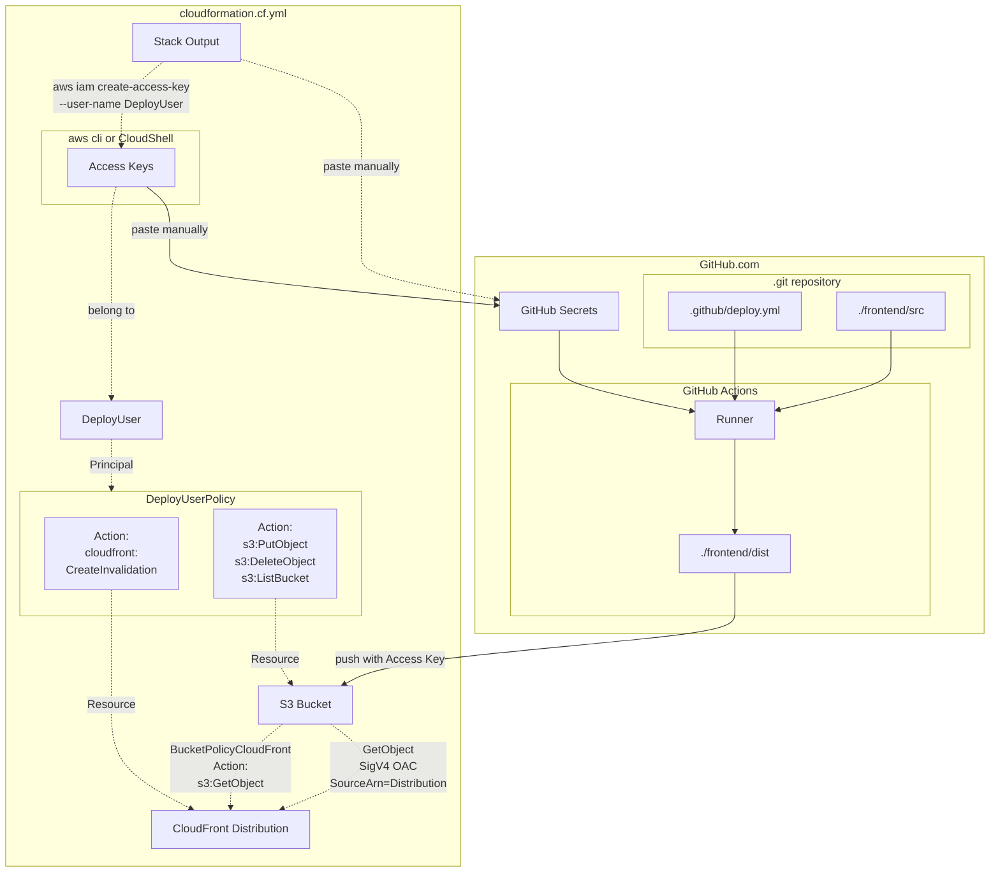
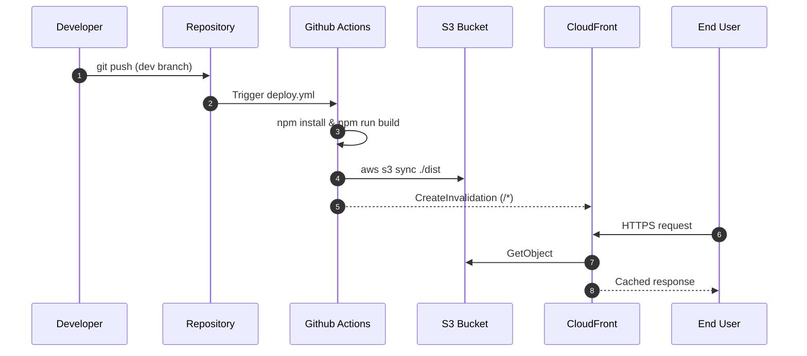

# aws-astro-headless-cms-deployment

Proof of Concept for deploying a **static website** built with **Astro** using **GitHub Actions** and **AWS-native infrastructure**.

Once set up, developers only work in GitHub.
Every push to the `dev` branch automatically builds the site and deploys it to a **globally distributed CDN (CloudFront)** backed by a **private S3 bucket**.

The infrastructure is fully provisioned via **AWS CloudFormation (IaC)** and designed with **least-privilege IAM**.

---

## Overview

**What this project demonstrates**

* Static Site Generation (SSG) with Astro
* CI/CD with GitHub Actions
* Secure static hosting on AWS (S3 + CloudFront + OAC)
* Infrastructure provisioning via CloudFormation
* Minimal human interaction after initial setup

**High-level flow**

1. Developer pushes frontend source code to GitHub
2. GitHub Actions builds the static site
3. Build artifacts are synced to a private S3 bucket
4. CloudFront serves the site globally via HTTPS

---

## Architecture & Tech Stack

### Core Components

* **Astro**

  * Static Site Generator
  * Source lives in `frontend/`
  * Build output goes to `frontend/dist/`

* **GitHub**

  * Source code repository
  * CI/CD via GitHub Actions
  * Stores deployment secrets

* **AWS CloudFormation**

  * Provisions all infrastructure deterministically
  * Enables reproducibility and drift detection

* **AWS S3**

  * Stores static build artifacts
  * No public access, no website configuration

* **AWS CloudFront**

  * HTTPS, caching, global distribution
  * Uses **Origin Access Control (OAC)** to access S3

* **AWS IAM**

  * Dedicated deploy user with least-privilege permissions
  * Access keys used by CI pipeline (OIDC planned)

### Topology

The overview shows cloudformation.cf.yml resources with simplified relations when creating a deploy user and hosting the actual build on GitHub Actions.



---

## Repository Structure

```text
.
├── frontend/          # Astro SSG project
│   ├── src/           # Website source (Markdown, Astro)
│   ├── dist/          # Build output (generated, ignored)
│   └── .gitignore
├── cloudformation/    # AWS infrastructure (IaC)
│   └── cloudformation.cf.yml
├── .github/
│   └── workflows/
│       └── deploy.yml # CI/CD pipeline
├── doc/               # Optional documentation & patches
└── README.md
```

---

## How It Works

### Infrastructure Provisioning

The CloudFormation template (`cloudformation.cf.yml`) creates:

* Private S3 bucket for website artifacts
* CloudFront distribution
* Origin Access Control (OAC)
* IAM deploy user with:

  * `s3:PutObject`, `s3:DeleteObject`, `s3:ListBucket`
  * `cloudfront:CreateInvalidation`

~~No~~ few manual AWS console configuration is required beyond stack creation: paste credentials from Stack Output to GitHub Secrets

---

### CI / CD Flow



---

## Quickstart

### 1. Prerequisites

* AWS account
* Node.js
* Git
* AWS CLI
* Any code editor (VS Code recommended)

> ⚠️ If you use WSL:
> Make sure `git`, `node`, and `npm` are available in the same environment.

---

### 2. Clone or Fork the Repository

```bash
git clone https://github.com/Codingschule/aws-astro-headless-cms-deployment.git
cd aws-astro-headless-cms-deployment
```

---

### 3. Provision AWS Infrastructure

Deploy the CloudFormation stack:

```bash
aws cloudformation deploy \
  --template-file cloudformation/cloudformation.cf.yml \
  --stack-name my-astro-site \
  --region us-east-1
```

Verify success:

```bash
aws cloudformation describe-stacks \
  --stack-name my-astro-site \
  --query "Stacks[0].StackStatus" \
  --output text
```

Expected result: `CREATE_COMPLETE`

---

### 4. Build and Deploy Manually (for Understanding)

Although CI/CD automates this, you should understand the manual steps:

```bash
cd frontend
npm install
npm run build
```

Sync build output to S3:

```bash
aws s3 sync ./dist s3://<BucketNameWeb> --delete
```

This mirrors exactly what the GitHub Actions pipeline does.

---

### 5. Configure GitHub Secrets

Create access keys for the deploy user and add them to the GitHub repository:
Repository ==> Secrets

* `AWS_ACCESS_KEY_ID`
* `AWS_SECRET_ACCESS_KEY`
* `AWS_REGION`
* `S3_BUCKET`
* `CLOUDFRONT_DISTRIBUTION_ID`

---

### 6. Deploy via CI/CD

Push changes to `dev`:

```bash
git push origin dev
```

GitHub Actions will:

* Build the Astro site
* Sync artifacts to S3
* Invalidate CloudFront cache

---

## CloudFormation Outputs

After deployment, the stack provides:

* **CloudFrontDomainName**
  → Access your website

* **BucketNameWeb**
  → Private S3 bucket name (used by CI)

* **DistributionId**
  → Required for cache invalidation

* **DebugSyncCommand**
  → Helpful for manual uploads

* **BucketBlockedWebsite / BucketBlockedUrl**
  → Expected to return `AccessDenied` or `NoSuchWebsiteConfiguration`

This verifies that **direct S3 access is blocked**.

---

## Local Development with Astro

```bash
cd frontend
npm run dev
```

* Dev server: http://localhost:4321
* Auto-reloads on source changes

Other useful commands:

```bash
npm run build    # Generate static output
npm run preview  # Serve dist/ locally
```

---

## Cost Considerations

* GitHub Actions: free for open-source projects
* S3: minimal storage cost
* CloudFront: typically free tier–friendly for low traffic

Use the [calc][AWS Cost Calculator] for estimates.

---

## Design Rationale

* **S3 + CloudFront** instead of S3 website hosting

  * HTTPS
  * Better security
  * Global caching

* **GitHub Actions** over AWS CodePipeline

  * Developer familiarity
  * Lower barrier to entry
  * No vendor lock-in

* **CloudFormation**

  * Deterministic infrastructure
  * Easy teardown and recreation
  * No hidden manual state

---

## Enhancements & Next Steps

* Replace deploy user with **OIDC + STS (recommended)**
* Custom domain + ACM certificate
* Multi-environment deployments (test / prod)
* Smarter CloudFront invalidation strategy
* Optional serverless features
* Evaluate Terraform vs. CloudFormation
* Headless CMS integration (see below)

---

## Out of Scope: Strapi (Headless CMS)

Strapi is **not part of the core project**, but can be integrated.

### Local Strapi Quickstart

```bash
npx create-strapi-app backend-strapi
cd backend-strapi
npm run dev
```

### Integrating Strapi with Astro

* Use REST or GraphQL
* Configure `STRAPI_URL` in `.env`
* Apply the provided patch file if needed

See:

* [integrate][Strapi integrations]
* [Patchfile](./doc/integrate_strapi_into_astro.patch)

---

## Authors

* [matt][Matthias Block] — Code
* [sam][Sam Dillenburg] — Planning & Mentoring
* ChatGPT - add long dashes

## links and thanks

- [AWS guide+video on S3 w/ CloudFront and (outdated) OAI][guide_cloudfront]

[integrate]: https://strapi.io/integrations "strapi.io/integrations"
[themes]: https://astro.build/themes/1/?search=&price%5B%5D=free "Free Astro Starter Themes"
[astro]: https://astro.build/ "astro static site generator"
[strapi]: https://strapi.io/ "Strapi CMS - SaaS or selfhosted"

[patchfile]: ./doc/integrate_strapi_into_astro.patch "Patchfile"
[frontend]: ./frontend/ "frontend"
[gitignore]: ./frontend/.gitignore "frontend/.gitignore"
[dist]: ./frontend/dist/ "static website generated(built) by astro using `npm run build`"
[deploy]: ./.git

[repolink]: https://github.com/Codingschule/aws-astro-headless-cms-deployment "Internal link to this repository"
[matt]: https://github.com/yasuoiwakura "Matthias Block" 
[sam]: https://github.com/hackbraten68 "Sam Dillenburg"

[aws_oac]: https://aws.amazon.com/de/blogs/networking-and-content-delivery/amazon-cloudfront-introduces-origin-access-control-oac/ "AWS OAC INtroduction"
[guide_s3_oac]: https://docs.aws.amazon.com/AmazonCloudFront/latest/DeveloperGuide/private-content-restricting-access-to-s3.html "AWS Site about S3 BucketPolicy regarding OAC and restricted access"
[guide_cloudfront]: https://aws.amazon.com/de/cloudfront/getting-started/S3/ "Amazon CloudFront Tutorials: Setting up a CloudFrotn Distribution"
[template]: https://github.com/aws-cloudformation/aws-cloudformation-templates/blob/main/S3/compliant-static-website.yaml "complete compliant-static-website.yaml"
[calc]: https://calculator.aws/ "AWS cost calculator"

